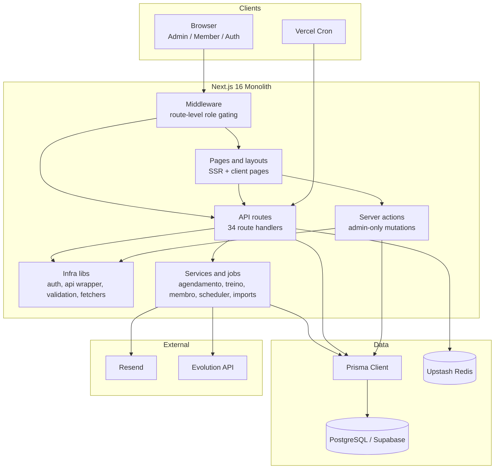
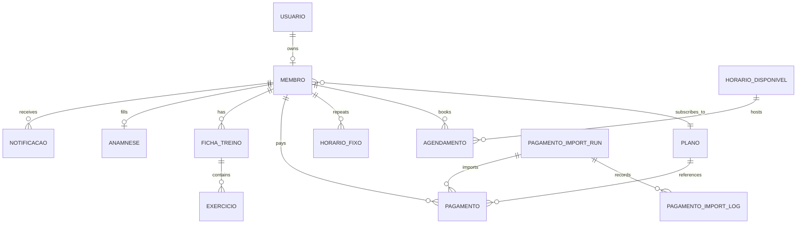

# Architecture Review

Current-state review of the repository as observed on 2026-04-01.

## Executive Summary

This system is a product monolith built on Next.js App Router, Prisma, and PostgreSQL. For the current product scope, that is the right top-level shape: the app keeps auth, members, scheduling, training, payments, notifications, and import tooling in one deployable unit, which reduces coordination cost and keeps feature delivery simple.

The architecture is good enough for the current size, but it is not fully optimized. The main weaknesses are not at the infrastructure level; they are at the boundary level. Business logic is split inconsistently between route handlers, services, pages, and jobs. Some operational contracts also drifted out of sync with the code, especially around health checks, cron jobs, Docker support, and documentation.

My overall assessment is:

- Good product-fit monolith: yes
- Good long-term maintainability without refactoring: no
- Good operational maturity: partial
- Current-state score: `6.7/10`

## System Diagram

## Core Domain Model

## How The System Works Right Now

### Runtime shape

- The browser talks to one Next.js application.
- `src/middleware.ts` performs coarse route gating before page render.
- Pages use two patterns:
  - server-rendered pages that call `auth()` and query Prisma directly
  - client pages that fetch JSON APIs through `fetch` or SWR
- API handlers usually use `withApiAuth()` plus Zod validation.
- Persistence is entirely Prisma to PostgreSQL.
- Background work is triggered by cron endpoints under `src/app/api/cron/*`.
- External delivery is done through Resend for email and Evolution for WhatsApp.

### Main user-facing flows

- Auth and onboarding:
  - Credentials login with NextAuth JWT sessions
  - Email verification and password-reset token flows
  - Profile completion and anamnesis completion before full member usage
- Member lifecycle:
  - Admin creates and edits members
  - Member profile data lives across `Usuario`, `Membro`, and `Anamnese`
- Scheduling:
  - `HorarioDisponivel` stores slot inventory
  - `Agendamento` stores concrete dated bookings
  - `HorarioFixo` stores recurring weekly intent
  - Future recurring bookings are materialized on read
- Training:
  - Active training plans per member with exercises
  - Training templates for reuse
  - PDF generation for plan export
- Finance:
  - Plans, payments, member-scoped reads, admin writes
  - Audited DOCX import pipeline with dry-run, apply, idempotency, and rollback
- Notifications:
  - Daily cron-driven reminders and cleanup
  - WhatsApp reminders via dedicated job plus scheduler-based reminders

### Layering, as implemented

The repo is not a clean layered architecture. It is a hybrid:

- Infrastructure is centralized reasonably well:
  - `src/lib/auth.ts`
  - `src/lib/api.ts`
  - `src/lib/prisma.ts`
  - `src/lib/security/*`
- Domain logic is only partially extracted:
  - `src/services/agendamento.service.ts`
  - `src/services/treino.service.ts`
  - `src/services/membro.service.ts`
- A large amount of application logic still lives in route handlers:
  - `src/app/api/agendamentos/[id]/route.ts`
  - `src/app/api/auth/cadastro/route.ts`
  - `src/app/api/perfil/route.ts`
  - `src/app/api/membros/route.ts`
  - `src/app/api/membros/[id]/route.ts`
- Some page components query Prisma directly, which bypasses the service layer entirely:
  - `src/app/page.tsx`
  - `src/app/(admin)/dashboard/page.tsx`
  - `src/app/(aluno)/inicio/page.tsx`

That means the architecture is understandable, but not yet disciplined.

## Main Architectural Decisions Observed

| Decision | Why it exists | Upside | Cost | Verdict |
| --- | --- | --- | --- | --- |
| Single Next.js monolith | Small product with tightly coupled domains | Fast delivery, low ops overhead, simple deployment | Risk of fat routes and page bloat | Correct choice for now |
| NextAuth credentials + JWT sessions | Simple first-party auth without external IdP | Stateless, easy in serverless/Vercel | Harder immediate revocation, coarse session model | Acceptable |
| Middleware + API auth wrapper + server-action guard | Defense in depth | Strong role boundary pattern | Duplicate logic can drift | Good idea, unevenly maintained |
| Prisma + PostgreSQL with `DATABASE_URL` / `DIRECT_URL` split | Supabase pooler compatibility | Good runtime and migration separation | More env complexity | Good decision |
| Recurring schedules via `HorarioFixo` plus materialization | Need weekly patterns with capacity limits | Pragmatic data model, easy explicit edits | Read path mutates state, more date complexity | Good but needs hardening |
| Hybrid SSR + SWR fetching | Mix of dashboards and interactive UIs | Good UX and low complexity | Data-access patterns become inconsistent | Acceptable |
| Internal cron endpoints | Fits Vercel cron model | Easy scheduling without extra infra | No queue, limited retry semantics | Acceptable but not robust |
| Separate audited payment import subsystem | High-risk finance operation | Best-designed subsystem in repo | More code and schema surface | Very good decision |
| Supabase RLS enablement | Security-advisor compliance and DB hardening intent | Better baseline posture | Current policies are broad and mostly server-role oriented | Useful, but not a true tenant boundary |

## What Is Working Well

- The monolith shape is appropriate. Nothing in the current domain split justifies microservices.
- The data model is coherent. Core domains are clearly separated in Prisma and match the product surface.
- Security basics are respectable:
  - auth at middleware
  - auth at APIs
  - ownership checks for member-scoped data
  - cron secret validation with timing-safe comparison
  - rate limiting on sensitive auth flows
- The payment import pipeline is unusually mature for a repo of this size:
  - dry-run mode
  - idempotency
  - audit logs
  - rollback lineage
- Test coverage is meaningful, not decorative. There are `49` test files and `265` passing tests, with strong API coverage.
- Type safety is in place and `npm run typecheck` passes.
- Source-scoped linting is clean: `npx eslint src` passes.

## What Is Not Optimal Right Now

- Service extraction is inconsistent.
  - There are `34` API route files but only `3` service modules.
  - The result is fat route handlers with validation, orchestration, persistence, and policy all mixed together.
  - This is the largest long-term maintainability problem.

- Scheduling reads have side effects.
  - `GET /api/agendamentos` calls `syncAgendamentosRecorrentes()`.
  - That means a read request can create slots and bookings in the database.
  - It is pragmatic, but it couples latency, correctness, and write contention to read traffic.

- Time handling is fragmented.
  - Scheduling uses noon-normalized dates to avoid timezone shifts.
  - The member/admin dashboard uses `America/Cuiaba`.
  - The WhatsApp billing job defaults to `America/Sao_Paulo`.
  - Environment examples point to `APP_TIMEZONE`, but runtime usage is not centralized.
  - This will eventually create subtle bugs.

- Cron responsibilities overlap.
  - `vercel.json` schedules both `/api/cron/tarefas-diarias` and `/api/cron/cobrancas-whatsapp` at the same time.
  - The daily scheduler already processes payment reminders.
  - The dedicated WhatsApp billing job also processes payment reminders.
  - Because their dedupe keys differ, this can race or duplicate reminders depending on execution order.

- The health contract is inconsistent.
  - `src/middleware.ts` treats `/api/health` as public.
  - `Dockerfile` uses `/api/health` as an unauthenticated healthcheck.
  - But `src/app/api/health/route.ts` still requires `withApiAuth()`.
  - That makes the self-hosted healthcheck path operationally wrong.

- The self-hosted deployment story is only partial.
  - There is a `Dockerfile`.
  - `vercel.json` is actively maintained.
  - But there is no `docker-compose.yml`, even though `.env.example` and older docs still refer to it.
  - So Vercel is first-class; Docker is only half-first-class.

- Defense-in-depth auth has already drifted.
  - Middleware and layouts both enforce roles.
  - That is fine in principle, but redirects are inconsistent.
  - Example: admin layout redirects non-admins to `/meus-dados`, which does not exist in the current route map.

- Observability is thin.
  - Logging is mostly `console.*`.
  - There is no metrics backend, tracing sink, job dashboard, or structured retry/outbox pattern for notifications.
  - This is acceptable for a small app but below good production maturity.

- Documentation is not an authoritative source anymore.
  - Existing architecture and decision docs are useful historical artifacts.
  - They are not fully current.
  - They still describe removed files, older cron shapes, and outdated operational behavior.

- Default lint ergonomics are weak.
  - `npm run lint` traverses generated `.next` artifacts inside `.claude/worktrees/**`.
  - The source code itself lints cleanly, but the default command is not a clean signal.
  - This is a tooling-boundary issue, not a core code-quality issue.

## Architecture Scorecard

| Category | Score | Notes |
| --- | --- | --- |
| Product-team fit | `8/10` | Monolith is the right choice for current scope |
| Domain modeling | `8/10` | Prisma schema matches product concepts well |
| Maintainability | `6/10` | Too much business logic in route handlers |
| Security | `7/10` | Good basics, but coarse permissions and some drift |
| Operational resilience | `5/10` | Cron overlap, health mismatch, limited observability |
| Scalability | `7/10` | Fine for current load, but read-side writes and no queues will hurt later |
| Developer experience | `6/10` | Good tests and typing, but lint/tooling scope is messy |
| Testability | `8/10` | API and domain coverage are strong |

Overall: `6.7/10`

Interpretation:

- This is a strong small-to-medium product monolith.
- It is not an optimized long-term platform yet.
- The next gains should come from boundary cleanup, not infrastructure replacement.

## Highest-Value Next Moves

1. Move route-level business logic into application services.
   - Start with auth onboarding, members, payments, and scheduling mutations.
   - Goal: thin route handlers, testable use cases, one place for policy.

2. Centralize date and timezone policy.
   - One canonical app timezone.
   - One date-normalization policy.
   - Remove hardcoded timezone values from pages and jobs.

3. Collapse payment reminder logic into one pipeline.
   - Keep either the scheduler path or the dedicated WhatsApp job, not both.
   - Add a stable idempotency key for notification delivery, not just loose temporal dedupe.

4. Fix the health/deployment contract.
   - Either make `/api/health` truly public, or stop using it in unauthenticated healthchecks.
   - Update deployment docs to match the real supported topology.

5. Add operational visibility.
   - Structured logs for cron runs and delivery failures
   - Counters for sent/skipped/failed reminders
   - Alerting for failed cron jobs
   - Eventually an outbox or queue for message delivery

6. Remove duplicate auth drift.
   - Keep middleware for coarse route gating.
   - Keep API/server-action auth for real authorization.
   - Minimize duplicate redirect policy inside layouts unless there is a UX reason.

7. Clean repo tooling boundaries.
   - Tighten ESLint ignores for nested generated artifacts.
   - Treat historical docs as generated review output or keep one canonical architecture doc.

## Verification

The assessment above was checked against the repository, not inferred from naming alone.

- Structural counts:
  - `34` API route files
  - `26` page files
  - `4` layout files
  - `3` service modules
  - `49` test files
- Automated checks:
  - `npm run test:run` -> passed (`49` files, `265` tests)
  - `npm run typecheck` -> passed
  - `npx eslint src` -> passed
  - `npm run lint` -> not a clean signal because it traverses generated nested `.next` artifacts under `.claude/worktrees/**`

## Evidence Base

Primary evidence used for this review:

- Runtime and auth:
  - `src/lib/auth.ts`
  - `src/lib/api.ts`
  - `src/middleware.ts`
  - `src/lib/security/cron-auth.ts`
  - `src/lib/security/server-action-auth.ts`
- Core domains:
  - `src/services/agendamento.service.ts`
  - `src/services/treino.service.ts`
  - `src/services/membro.service.ts`
  - `src/app/api/agendamentos/route.ts`
  - `src/app/api/agendamentos/[id]/route.ts`
  - `src/app/api/membros/route.ts`
  - `src/app/api/membros/[id]/route.ts`
  - `src/app/api/perfil/route.ts`
  - `src/app/api/auth/cadastro/route.ts`
  - `src/app/api/anamnese-token/route.ts`
  - `src/app/api/pagamentos/route.ts`
  - `src/app/api/treinos/route.ts`
- Jobs and integrations:
  - `src/lib/scheduler.ts`
  - `src/lib/jobs/cobranca-whatsapp.ts`
  - `src/lib/resend.ts`
  - `src/lib/whatsapp/evolution.ts`
  - `src/lib/rate-limit.ts`
  - `src/lib/cleanup.ts`
- Pages and direct data access:
  - `src/app/page.tsx`
  - `src/app/(admin)/dashboard/page.tsx`
  - `src/app/(admin)/layout.tsx`
  - `src/app/(aluno)/inicio/page.tsx`
- Data and deployment:
  - `prisma/schema.prisma`
  - `prisma/migrations/*`
  - `next.config.ts`
  - `vercel.json`
  - `Dockerfile`
  - `.env.example`
  - `.github/workflows/ci.yml`

